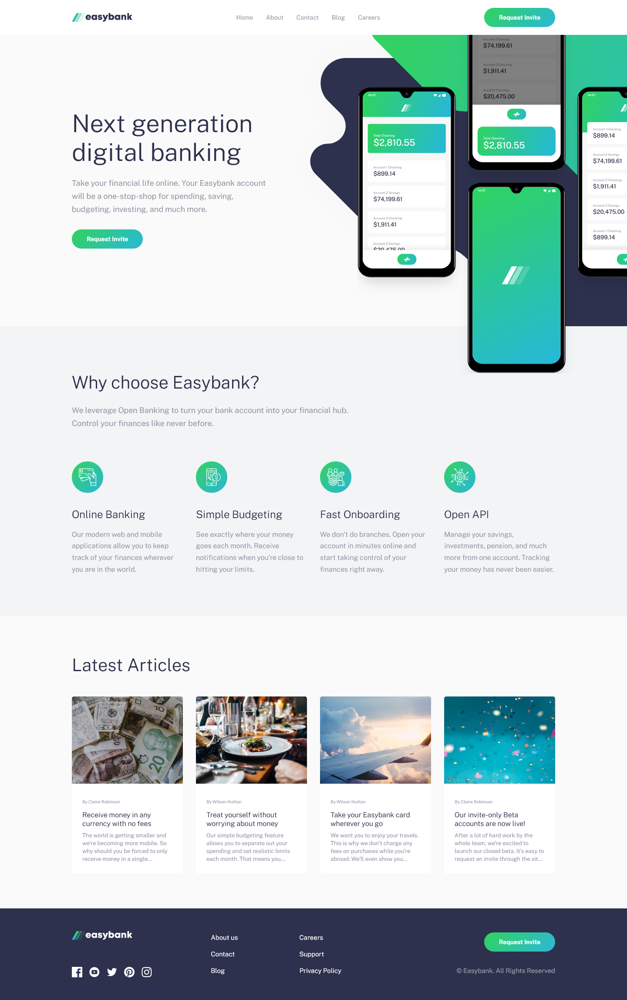

# Frontend Mentor - Easybank landing page solution

This is a solution to the [Easybank landing page challenge on Frontend Mentor](https://www.frontendmentor.io/challenges/easybank-landing-page-WaUhkoDN). Frontend Mentor challenges help you improve your coding skills by building realistic projects.

## Table of contents

- [Overview](#overview)
  - [The challenge](#the-challenge)
  - [Screenshot](#screenshot)
  - [Links](#links)
- [My process](#my-process)
  - [Built with](#built-with)
  - [What I learned](#what-i-learned)
  - [Continued development](#continued-development)
- [Author](#author)

## Overview

### The challenge

Users should be able to:

- View the optimal layout for the site depending on their device's screen size
- See hover states for all interactive elements on the page

### Screenshot



### Links

- Solution URL: [https://www.frontendmentor.io/solutions/responsive-landing-page-using-css-grid-and-flexbox--t-Vo1cNV](https://www.frontendmentor.io/solutions/responsive-landing-page-using-css-grid-and-flexbox--t-Vo1cNV)
- Live Site URL: [https://abedfetrat.github.io/fem01-easybank-landing-page/](https://abedfetrat.github.io/fem01-easybank-landing-page/)

## My process

### Built with

- Semantic HTML5 markup
- CSS custom properties
- Flexbox
- CSS Grid
- Mobile-first workflow

### What I learned

- I learned to use the `<picture> ` element to offer alternative images for different screen sizes/resolutions:

```html
<picture class="hero__background-graphic-container">
  <source srcset="./images/bg-intro-desktop.svg" media="(min-width: 1100px)" />
  <source srcset="./images/bg-intro-mobile.svg" />
  
</picture>
```

- Further practice positioning background elements/graphics over multiple layers.
  For example the graphics used in the hero section.

### Continued development

- Make layout changes for the in between resolutions of desktop and mobile.
  For example use a more flexible grid and flexbox solution starting from mobile.

- Make more use of CSS Custom properties to write more flexible code.

- Further imrove site accessibillty

## Author

- Frontend Mentor - [@abedfetrat](https://www.frontendmentor.io/profile/abedfetrat)
- LinkedIn - [](https://www.linkedin.com/in/abed-fetrat-84728717a?lipi=urn%3Ali%3Apage%3Ad_flagship3_profile_view_base_contact_details%3BUKdPHQu3Qm%2B6krqAb0fxCw%3D%3D)
